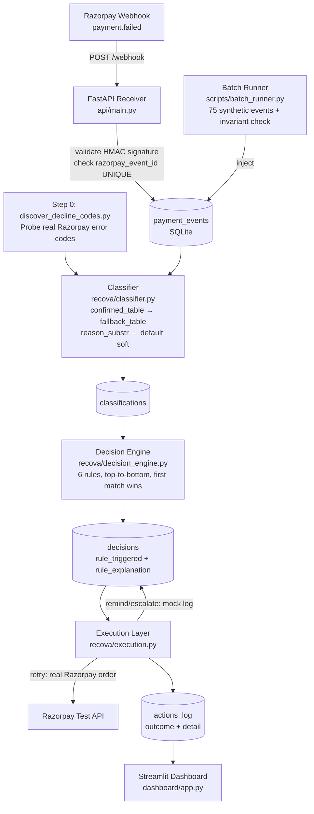

# ReCova — AI Revenue Recovery Agent

> Razorpay Buildathon · Revenue Recovery Track

ReCova detects failed recurring/subscription payments on Razorpay (test mode), classifies each failure as a hard or soft decline using a rules-based lookup, decides a bounded recovery intervention, executes it, and logs a full audit trail with measurable recovery-rate metrics.

**No LLMs. Every decision is one readable rule with a written reason.**

---

## Problem Statement

Failed subscription payments are silent revenue leaks. A SaaS company processing ₹10L/month in recurring billing can lose ₹8–15% to soft declines (temporary: insufficient funds, issuer downtime) and hard declines (permanent: expired/blocked cards). Most platforms surface these as a dashboard number and stop there. ReCova closes the loop:

- **Detects** failures via Razorpay webhooks in real time
- **Classifies** each failure as hard or soft using confirmed Razorpay error codes
- **Decides** the right intervention (immediate retry, scheduled retry, reminder, escalation, or stop) using explicit, auditable rules
- **Executes** the decision and records the outcome
- **Measures** recovery rate, time-to-recovery, and rule effectiveness in a live dashboard

---

## Architecture



---

## Decision Rules (rule precedence — first match wins)

Rules are evaluated top-to-bottom. This precedence is deliberate:

| Priority | Rule name | Condition | Decision | Why |
|---|---|---|---|---|
| 1 | `rule_1_stale_stop` | Payment age > 14 days | `stop` | Too stale; policy beats recovery |
| 2 | `rule_2_hard_permanent_stop` | Hard + blacklisted/lost/stolen/pickup | `stop` | Card permanently unusable; retry is harmful |
| 3 | `rule_3_hard_other_remind` | Hard + any other code | `send_reminder` | User must update card; system can't self-recover |
| 4 | `rule_4_soft_max_retries_escalate` | Soft + retry_count ≥ 3 | `escalate_promise_to_pay` | Automated retries exhausted |
| 5 | `rule_5_soft_low_amount_retry_now` | Soft + retry_count = 0 + amount ≤ ₹500 | `retry_now` | Low-risk immediate retry for small tickets |
| 6 | `rule_6_soft_retry_scheduled` | Soft + retry_count < 3 | `retry_scheduled` | Transient error; exponential backoff |

**₹500 threshold justification**: Small-ticket subscription tiers under ₹500 are treated as low-risk for an immediate retry because the cost of an extra declined attempt (no auth fee in test mode, negligible customer impact) is negligible relative to the recovery value of recovering even a single billing cycle.

---

## Project Structure

```
recova/
├── .env.example
├── README.md
├── requirements.txt
├── recova/
│   ├── db.py               # SQLite schema + connection + audit-chain helpers
│   ├── models.py           # Pydantic models for all layers
│   ├── classifier.py       # Two-tier decline code lookup
│   ├── decision_engine.py  # 6-rule decision tree with explicit constants
│   ├── execution.py        # Retry (real API) + mock reminder/escalation
│   └── pipeline.py         # classify → decide → execute orchestrator
├── api/
│   └── main.py             # FastAPI webhook receiver + read endpoints
├── scripts/
│   ├── discover_decline_codes.py  # Step 0: probe real error codes
│   ├── seed_razorpay.py           # Create test customers/plans/subscriptions
│   ├── simulate_payments.py       # Trigger batched test card payments
│   └── batch_runner.py            # 75-event pipeline test + invariant check
├── dashboard/
│   └── app.py              # Streamlit dashboard
├── tests/
│   ├── test_classifier.py
│   └── test_decision_engine.py
└── data/
    ├── recova.db            # SQLite DB (gitignored)
    ├── discovered_codes.json
    ├── seed_data.json
    └── batch_results.json
```

---

## Setup

### ⚡ Quick start (with `make`)

> **Fastest path for judges and reviewers** — one chain to see the full system work:

```bash
make setup        # install deps + create .env from template
# → Edit .env with your Razorpay test credentials, then:
make discover     # Step 0: probe real Razorpay error codes → data/discovered_codes.json
make seed         # create test customers / plans / subscriptions in Razorpay test mode
make batch        # run 75 synthetic events through the full pipeline
make dashboard    # open the Streamlit recovery dashboard
```

Other useful targets:

| Target | What it does |
|---|---|
| `make api` | Start FastAPI webhook receiver (`uvicorn api.main:app --reload`) |
| `make test` | Run the full pytest suite (`pytest tests/ -v`) |
| `make simulate` | Trigger live test-card payments (requires `make api` running) |
| `make clean` | Remove `data/recova.db` and `data/batch_results.json` for a fresh run |

> **No `make`?** (e.g. Windows without WSL) — use the raw commands in the steps below.

---

### Step-by-step (raw commands)

### 1. Clone and install

```bash
git clone <repo>
cd recova
pip install -r requirements.txt
```

### 2. Configure environment

```bash
cp .env.example .env
# Edit .env and fill in:
# RAZORPAY_KEY_ID=rzp_test_...
# RAZORPAY_KEY_SECRET=...
# RAZORPAY_WEBHOOK_SECRET=...  (from Razorpay dashboard → Webhooks)
```

### 3. Step 0 — Discover real decline codes (run before anything else)

```bash
python scripts/discover_decline_codes.py
```

Review `data/discovered_codes.json` before proceeding. This file is what the classifier builds from.

### 4. Seed test data

```bash
python scripts/seed_razorpay.py
```

### 5. Start the API server

```bash
uvicorn api.main:app --reload
```

### 6. Run the batch test (no live server needed)

```bash
python scripts/batch_runner.py
```

Outputs a summary to console and `data/batch_results.json`.

### 7. Open the dashboard

```bash
streamlit run dashboard/app.py
```

### 8. (Optional) Simulate live webhooks

Expose localhost with ngrok:
```bash
ngrok http 8000
```
Add the ngrok URL + `/webhook` to your Razorpay test dashboard under Webhooks, then:
```bash
python scripts/simulate_payments.py
```

### 9. Run tests

```bash
pytest tests/ -v
```

---

## Database Schema

```
payment_events  ←─────────────────────────────────────────────────┐
  id, razorpay_event_id (UNIQUE), payment_id, subscription_id,    │
  customer_id, amount, currency, status, error_*, raw_payload,    │
  created_at                                                       │
                                                                   │
classifications (FK → payment_events)                              │
  id, payment_event_id, classification, confidence, reason,        │
  error_code, error_reason, lookup_source, created_at             │
                                                                   │
decisions (FK → classifications)                                   │
  id, classification_id, decision, retry_at,                      │
  rule_triggered, rule_explanation, created_at                    │
                                                                   │
actions_log (FK → decisions)  ─────────────────────────────────────┘
  id, decision_id, action_type, payload, outcome,
  outcome_detail, executed_at
```

FK chain for any audit lookup: `actions_log → decisions → classifications → payment_events`

`retry_count` is derived via `db.get_retry_count(subscription_id)` — a JOIN across the audit chain. There is no separate counter column; the audit trail is the single source of truth.

---

## Concurrency Limitation

The webhook receiver and the batch runner both write through the same pipeline. For this buildathon demo they are designed to run sequentially — do not fire live webhooks while a batch run is in progress. WAL mode is enabled on SQLite for concurrent reads, but concurrent writes from two processes are not tested and may produce inconsistent retry counts. This is a known, documented limitation for the demo scope.

---

## What Broke

> _Leave this blank until after the demo. Fill it in honestly — a panel that sees a real post-mortem respects the builder more than a spotless submission._

---

## Key Design Decisions

| Decision | Rationale |
|---|---|
| No LLMs | Every decision is explainable in one sentence per branch. Panel Q&A ready. |
| Default unknown codes to `soft` | A false `hard` silently abandons recoverable revenue. A false `soft` gets one extra retry before escalating — much less harmful. |
| Confirmed codes gate the classifier | Running Step 0 against the live test API before writing the classifier prevents building on wrong assumptions. |
| `retry_count` from audit log | No separate counter that can drift. The log is the truth. |
| `razorpay_event_id` UNIQUE constraint | Webhooks can redeliver. One DB constraint handles idempotency without application-layer complexity. |
| Rule precedence documented | Staleness check first — a 20-day-old failed payment should never trigger a retry regardless of decline type. |
